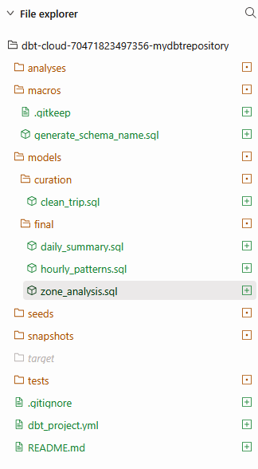
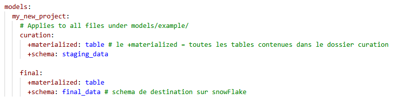

[VIDEO DEMO]()

## Mes requêtes SQL sur SNOWFLAKE 

### Pour créer la stage de connexion avec Azure (compte de stockage)
```sql
CREATE OR REPLACE STAGE to_blob_storage
URL = 'azure://doletgsnowflake.blob.core.windows.net/yellow-taxi'
CREDENTIALS=(AZURE_SAS_TOKEN='généré_sur_azure')
;

LIST @to_blob_storage;
```

 ### Pour créer la table et charger les fichiers parquets depuis Azure (en passant par la stage)
 ```sql
CREATE OR REPLACE TABLE RAW_DATA.trip_data (

    VendorID INTEGER,
    tpep_pickup_datetime STRING,
    tpep_dropoff_datetime STRING,
    passenger_count INT,
    trip_distance FLOAT,
    RatecodeID INTEGER,
    store_and_fwd_flag STRING,
    PULocationID STRING,
    DOLocationID STRING,
    payment_type INTEGER,
    fare_amount FLOAT,
    extra FLOAT,
    mta_tax FLOAT,
    tip_amount FLOAT,
    tolls_amount FLOAT,
    improvement_surcharge FLOAT,
    total_amount FLOAT,
    congestion_surcharge FLOAT,
    airport_fee FLOAT,
    cbd_congestion_fee FLOAT
);

COPY INTO RAW_DATA.trip_data
FROM @to_blob_storage
FILE_FORMAT = (TYPE = PARQUET)
MATCH_BY_COLUMN_NAME = CASE_INSENSITIVE
PATTERN = '.*\.parquet';
```

## Requêtes DBR

### Pour clean et enrichir la donnée (STAGGING)
```sql
WITH cleaned_trips AS (
    SELECT
        VENDORID,
        TO_TIMESTAMP(TPEP_PICKUP_DATETIME) AS pickup_datetime,
        TO_TIMESTAMP(TPEP_DROPOFF_DATETIME) AS dropoff_datetime,
        PASSENGER_COUNT,
        TRIP_DISTANCE,
        PULOCATIONID,
        DOLOCATIONID,
        FARE_AMOUNT,
        TOTAL_AMOUNT,
        TIP_AMOUNT
    FROM NYC_TAXI_DB.RAW_DATA.TRIP_DATA
    WHERE 
        -- Éliminer les montants négatifs
        FARE_AMOUNT >= 0
        AND TOTAL_AMOUNT >= 0
        -- Pickup avant dropoff
        AND TPEP_PICKUP_DATETIME < TPEP_DROPOFF_DATETIME
        -- Distances plausibles
        AND TRIP_DISTANCE BETWEEN 0.1 AND 100
        -- Exclure zones NULL
        AND PULOCATIONID IS NOT NULL
        AND DOLOCATIONID IS NOT NULL

)
SELECT
    VENDORID,
    pickup_datetime,
    dropoff_datetime,
    PASSENGER_COUNT,
    TRIP_DISTANCE,
    PULOCATIONID,
    DOLOCATIONID,
    FARE_AMOUNT,
    TOTAL_AMOUNT,
    TIP_AMOUNT,

    -- Durée du trajet en minutes
    DATEDIFF('minute', pickup_datetime, dropoff_datetime) AS trip_duration_min,

    -- Dimensions temporelles
    DATE_PART('hour', pickup_datetime)  AS pickup_hour,
    DATE_PART('day', pickup_datetime)   AS pickup_day,
    DATE_PART('month', pickup_datetime) AS pickup_month,

    -- Vitesse moyenne (miles par heure)
    CASE 
        WHEN DATEDIFF('minute', pickup_datetime, dropoff_datetime) > 0 
        THEN TRIP_DISTANCE / (DATEDIFF('minute', pickup_datetime, dropoff_datetime) / 60.0)
        ELSE NULL
    END AS avg_speed_mph,

    -- % de pourboire (par rapport au total sans négatifs)
    CASE 
        WHEN TOTAL_AMOUNT > 0 
        THEN (TIP_AMOUNT / TOTAL_AMOUNT) * 100
        ELSE NULL
    END AS tip_percentage

    

FROM cleaned_trips

-- Eliminer les dates hors année 2024 (56 lignes)
WHERE 
  YEAR(pickup_datetime) = 2024
  AND YEAR(dropoff_datetime) = 2024
```

### Pour créer les tables KPI en zone GOLD
Daily Summer Case :
```sql
SELECT
    CAST(PICKUP_DATETIME AS DATE) AS trip_date,
    COUNT(*) AS total_trips,
    AVG(TRIP_DISTANCE) AS avg_distance,
    SUM(TOTAL_AMOUNT) AS total_revenue
FROM {{ ref('clean_trip') }}
GROUP BY CAST(PICKUP_DATETIME AS DATE)
ORDER BY trip_date

```
Hourly Patterns Case :
```sql
SELECT
    PICKUP_HOUR,
    COUNT(*) AS trip_count,
    SUM(TOTAL_AMOUNT) AS total_revenue,
    AVG(AVG_SPEED_MPH) AS avg_speed
FROM {{ ref('clean_trip') }}
GROUP BY PICKUP_HOUR
ORDER BY PICKUP_HOUR
```
Zone Analysis Case :
```sql
SELECT
    PULOCATIONID AS pickup_zone,
    COUNT(*) AS trip_count,
    AVG(TOTAL_AMOUNT) AS avg_revenue,
    SUM(TOTAL_AMOUNT) AS total_revenue
FROM {{ ref('clean_trip') }} -- va directement se sourcer dans la table clean_trip dans le schéma STAGGING
GROUP BY PULOCATIONID
ORDER BY trip_count DESC
```

### Structure du projet DBT



